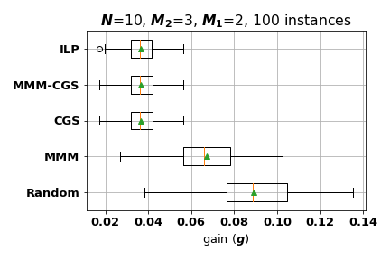

# Breif Explanation for Functions
## Optimization Algorithms
* ``opt_ilp.py`` corresponds to the Integer Linear Programming (ILP) optimization;
* ``alg_greedy.py`` corresponds to the Min-Max Greedy Matching (MMM) optimization;
* ``alg_cyclicgreedy.py`` corresponds to the MMM optimiztion with Cyclic Greedy Searching (CGS) initialization;
* ``alg_CGS.m`` corresponds to the CGS optimization;
* ``alg_cyclic.py`` converts the CGS result obtained with MATLAB to python version.
## Main Function
* ``dot.py`` is the main function;
* ``config.py`` holds the configuration of the DOT, i.e., the number of students ``n``, the size of the question pool ``m``, the number of questions in one test ``q``, the number of instances ``num_instances``.
## Others
* ``instance_helper.py`` can generate DOT instances ( ``n``,``m``,``q``, uniformly distributed competences ``y``, and Dirichlet distributed colluding matrix ``P``), and convert ``.instance`` (python version) to ``.mat`` (MATLAB version);
* ``report.py`` report the statistics of the optimization results of different algorithms with a box graph;
* ``scoring_helper.py`` computes the scores with collusion for each instance.

# Usage
## 1. Generate New Instances
* (1) Change the configurations in the ``config.py`` file accordingly;
* (2) Uncomment lines 33 and 34 in ``dot.py``,
```
instances = instance_helper.generate_instances(config.n, config.m, config.q, config.num_instances, loc=config.loc)
instance_helper.convert_instances_pickle_to_mat(loc=config.loc, num_instances=config.num_instances)
```
and comment all other lines in the main() function;
* (3) Run ``dot.py`` with Python.
Generated instances (both ``.instance`` and ``.mat`` files) will be saved under the folder ``{n}_{m}_{q}_instances``.

## 2. Comparing Optimization Results of Different Algorithms
* (1) Decide algorithms to use by commenting unwanted algorithms, e.g., if we do not want to include the ILP due to its long runtime, we can comment line 51,
```
# opt_ilp.run_ilp(instances, loc=config.loc) # ILP
```
* (2) Choose the results to be report by modifying line 54,
```
report.report(loc=config.loc, algs=['random', 'MMM', 'CGS', 'MMMCGS', 'ilp'])
```
We can delete the name of the algorithm from the ``algs`` list to mute the report of its result; e.g., replace it with the following line
```
report.report(loc=config.loc, algs=['random', 'MMM', 'CGS', 'MMMCGS'])
```
to mute the report of ILP.
* (3) Run ``dot.py`` with Python.
The output box plot will be saved under the folder sepecified in the ``config.py`` with ``figsavepth``.

### Notes:
* As mentioned, the ``alg_cyclic.py`` only reads the CGS results obtained with the ``alg_CGS.m`` (saved under the instances folder, with the name ``N{n}_Mp{m}_M{q}_alg2.mat``). Hence, if we want to include the CGS results in Sec 2, we need to run the ``alg_CGS.m`` with MATLAB prior running ``dot.py`` with Python;
* ``MMM-CGS`` relies on the result of ``CGS``, hence, we need to include ``CGS`` first if we want to include ``MMM-CGS``; 

### Example Reports





